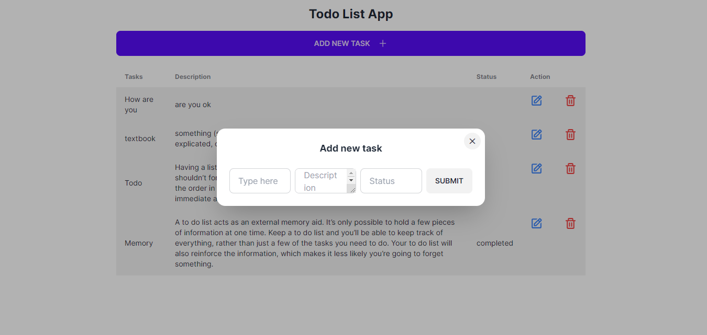

# **TODOAPP** #
This is a simple todo application built using Next.js, Tailwind CSS, TypeScript, and a mock API.

## Images ##

## Features 
- Add new todos
- Edit todos
- Delete todos
- Persist todos using the mock API

## Technologies Used 
- Next.js: A React framework for building server-side rendered and static web applications.
- Tailwind CSS: A utility-first CSS framework for rapidly building custom user interfaces.
- TypeScript: A typed superset of JavaScript that compiles to plain JavaScript.
- Git: A distributed version control system used for tracking changes in source code during development.
- Mock API: A simulated API that mimics the behavior of a real backend API for testing and development purposes.

## Getting Started ##
To get started with the Todo App, follow the steps below:
1. Clone the repository:
git clone repository-url

2. Install the dependencies:
cd todo-app
npm install

3. Run the development server:
npm run dev
Open your browser and navigate to http://localhost:3000 to access the application.

## For json-server ##
npm run json-server
Open your browser and navigate to http://localhost:3001 to access the data.

## Project Structure 
The project structure follows the conventions of a typical Next.js application:

- 'pages/': Contains the Next.js pages for routing and rendering components.
- 'components/': Contains reusable React components used in the application.
- 'styles/': Contains global styles and Tailwind CSS configuration.
- 'api/': Contains the mock API implementation for handling todo data.
- 'public/': Contains static assets such as images or fonts.
- 'utils/': Contains utility functions used throughout the application.